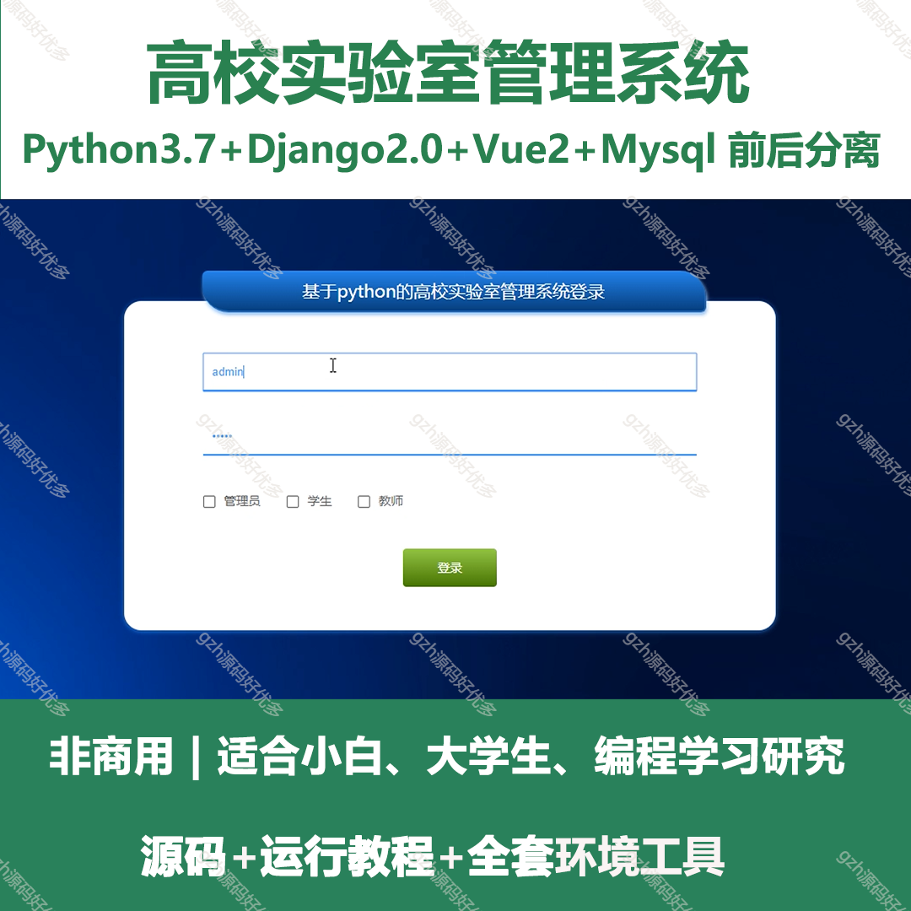
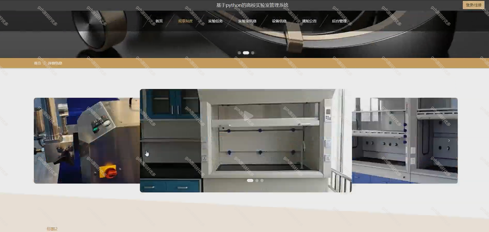
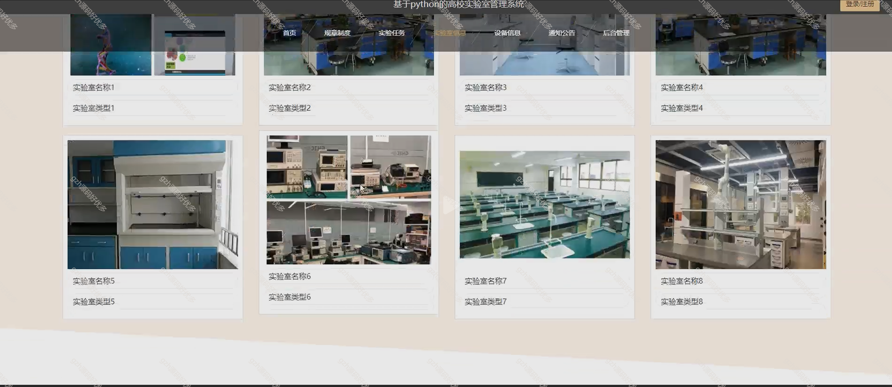
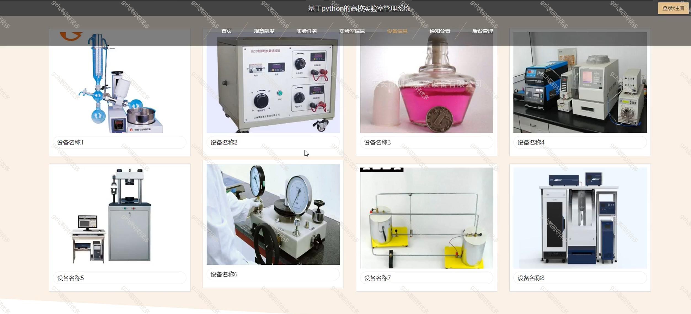
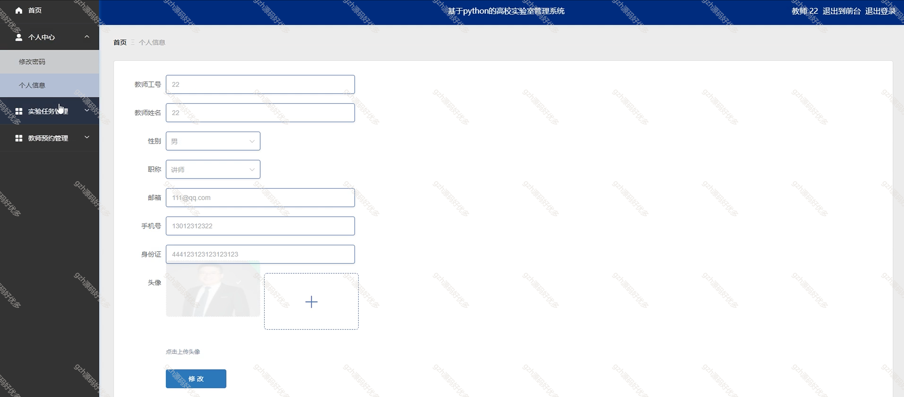
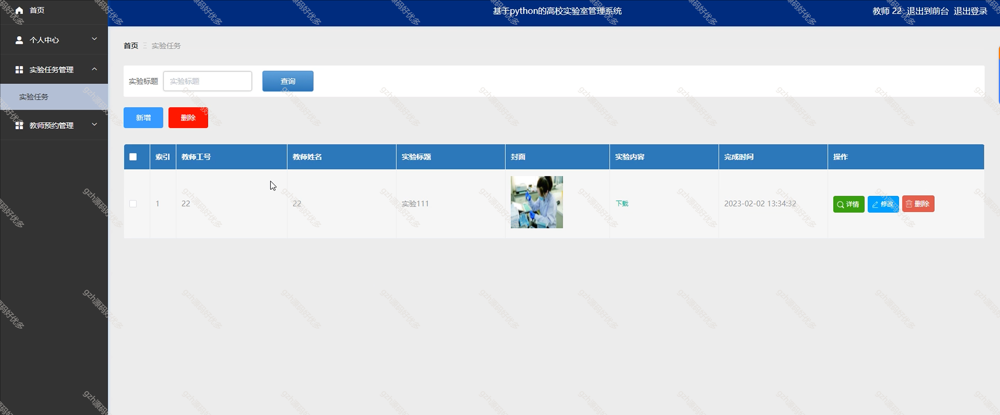
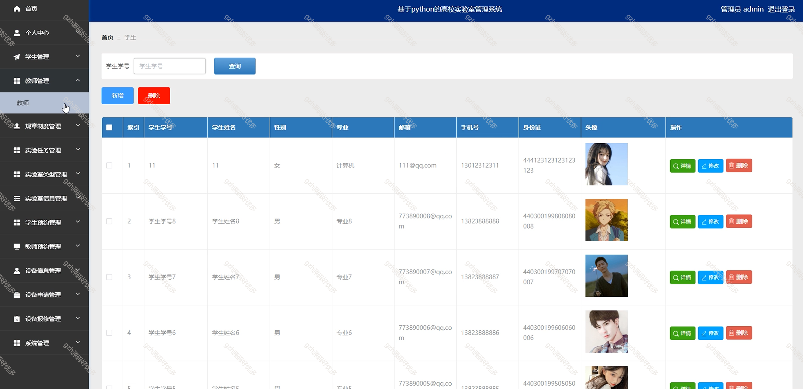
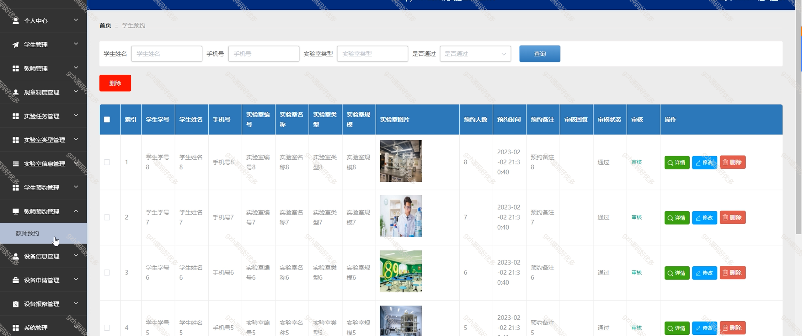
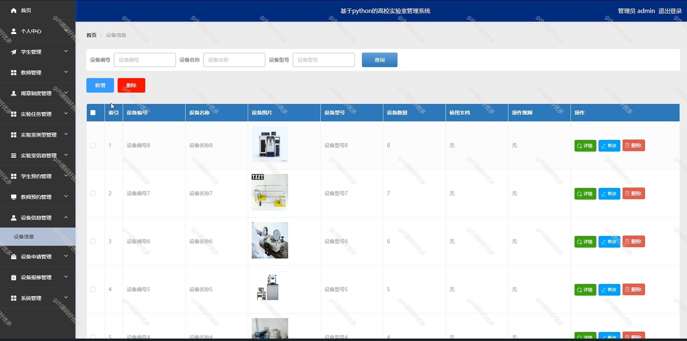

# python025
python025基于Python的高校实验室管理系统
 
## 查看主页获取源码

### 一、关键词

高校实验室管理系统、实验室预约系统

 

### 二、作品包含

源码+数据库+全套环境和工具资源+部署教程

 

### 三、项目技术

前端技术：Html、Css、Js、Vue2.0、Element-ui
后端技术：Python3.7、Django2.0

  

 

### 四、运行环境（以下版本亲测，其他版本未知，请自测）

开发工具：PyCharm + VSCODE

数据库：MySQL5.7（最低要5.7版本）

数据库管理工具：Navicat10+

Python：Python3.7

前端Nodejs：14

浏览器：谷歌浏览器

 

### 五、项目介绍

项目编号：python025

高校实验室管理系统面向管理员、教师、学生，具备实验室信息、设备、预约、使用记录、安全及数据统计等功能，实现资源高效调配与规范化管理，支撑教学科研有序开展 。

高校实验室管理系统功能覆盖多角色与多环节，支持管理员、教师、学生等角色，具备实验室资源（设备、耗材等 ）管理、实验预约及过程管控、数据共享分析、安全保障、用户权限分配，还有仪器设备全周期（预约、借用

 

### 六、运行截图

